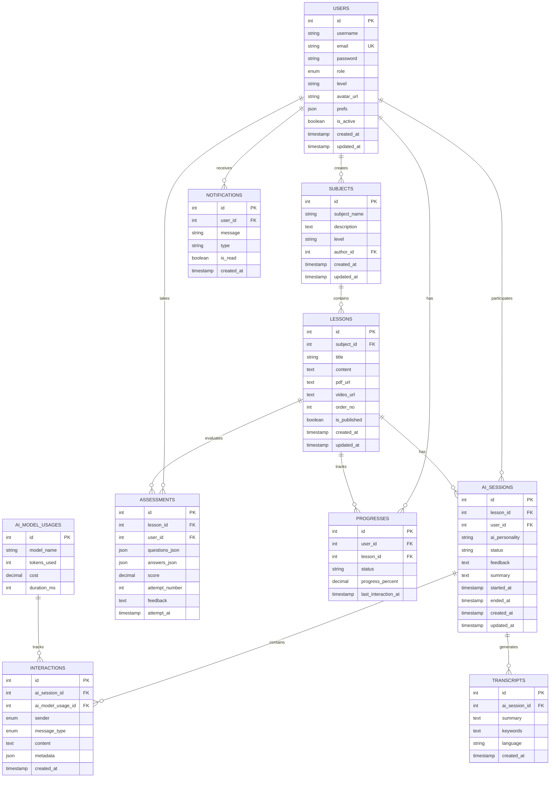

# Database Schema - AI Educational Platform

## Entity Relationship Diagram

## Summary of Created Entities

### 1. **Users** (`users`)
- Central entity for all platform users (students, teachers, admins)
- Contains authentication info, preferences, and role management
- Related to: subjects (as author), ai_sessions, assessments, progresses, notifications

### 2. **Subjects** (`subjects`)
- Educational subjects/courses
- Has an author (user) and contains multiple lessons
- Related to: users (as author), lessons

### 3. **Lessons** (`lessons`)
- Individual lessons within subjects
- Contains content, media URLs, and publication status
- Related to: subjects, ai_sessions, assessments, progresses

### 4. **AI Sessions** (`ai_sessions`)
- AI tutoring sessions for specific lessons
- Tracks session status, timing, and feedback
- Related to: lessons, users, interactions, transcripts

### 5. **Interactions** (`interactions`)
- Individual messages/interactions during AI sessions
- Tracks sender (user/AI), content type, and metadata
- Related to: ai_sessions, ai_model_usages

### 6. **Transcripts** (`transcripts`)
- Session summaries and transcripts
- Contains keywords and language information
- Related to: ai_sessions

### 7. **Assessments** (`assessments`)
- Quiz/assessment results for lessons
- Stores questions, answers, scores, and feedback
- Related to: lessons, users

### 8. **Progresses** (`progresses`)
- User progress tracking for lessons
- Tracks completion percentage and status
- Related to: users, lessons

### 9. **Notifications** (`notifications`)
- User notifications
- Tracks read status and notification type
- Related to: users

### 10. **AI Model Usages** (`ai_model_usages`)
- Tracks AI model usage and costs
- Monitors tokens, costs, and performance
- Related to: interactions

## Key Features Implemented

✅ **Complete Entity Structure**: All 10 entities with proper schemas
✅ **Relationship Management**: All foreign key relationships properly configured
✅ **Strapi Integration**: Full controllers, routes, and services for each entity
✅ **Data Types**: Proper field types including JSON, enums, decimals, and timestamps
✅ **Constraints**: Unique constraints, required fields, and defaults where appropriate
✅ **Educational Focus**: Designed specifically for AI-powered educational platform

## Next Steps

1. **Database Migration**: Run Strapi to generate the database schema
2. **Permissions**: Configure role-based permissions for different user types
3. **API Testing**: Test all CRUD operations for each entity
4. **Data Seeding**: Create sample data for testing
5. **Frontend Integration**: Connect with the frontend application
